# Enklawa Villas

> Przestrzeń, której nie da się powtórzyć.

Enklawa Villas to strona agencji rezydencji off-market: domów powyżej 800 m² na działkach powyżej 5 000 m²,
sprzedawanych dyskretnie, przez rozmowę z kuratorem. Strona otwiera się filmowym intro, prowadzi przez
scrollytelling z sekwencją klatek, pokazuje portfolio ośmiu rezydencji z osobnymi podstronami i kończy się
oknem zapytania w trzech krokach. Działa po polsku i po angielsku.

Całość to statyczny Astro 7 z GSAP i Lenisem. Bez backendu, bez bazy, bez cookies. Filmy i klatki są
przygotowane skryptami z `ffmpeg` i `sharp`, a obrazy idą jako AVIF i WebP.

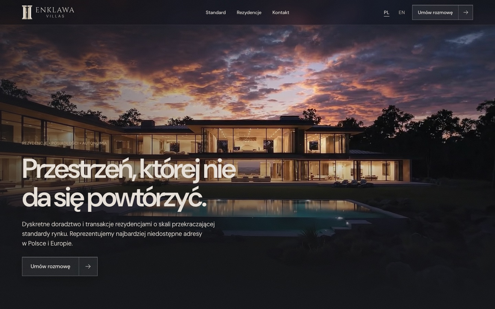

## Dla kogo

- **Dla agencji nieruchomości premium**, która sprzedaje przez relację, a nie przez wyszukiwarkę ogłoszeń.
  Strona buduje nastrój, pokazuje kilka wybranych obiektów i prowadzi do jednej akcji: rozmowy z kuratorem.
- **Dla deweloperów i studiów**, którzy szukają działającego przykładu scrollytellingu na `<canvas>`,
  intro w stylu filmowym i dopracowanych przejść, z testami e2e i bez ciężkiego frameworka.

Nie jest to portal z ogłoszeniami: nie ma wyszukiwarki, filtrów, kont ani płatności. To świadomy wybór.

## Jak to działa

```
videos/ (nagrania, poza repo)
   │  npm run hero · frames · previews · residences · brand
   ▼
public/video, public/frames, src/assets ──► astro build ──► dist/ (statyczny HTML)
                                                              │
przeglądarka ◄────────────────────────────────────────────────┘
   ├─ intro, scrollytelling, karty i slider   (GSAP, Lenis, canvas)
   └─ okno zapytania ──► mailto: office@enklawavillas.com
```

**Intro** gra przy wejściu z zewnątrz: plansza z logo przechodzi w film, kamera przelatuje między skałami
do domu, film zatrzymuje się na ostatniej klatce i z rozmycia wchodzi nagłówek. Przy przejściu z innej
podstrony albo z kotwicą w adresie intro jest pomijane, bez zapisywania czegokolwiek w przeglądarce.

**Scrollytelling** rysuje 192 klatki na `<canvas>` zsynchronizowane ze scrollem. Klatki są pobierane jako
bloby i dekodowane poza głównym wątkiem w oknie wokół bieżącej pozycji. Na telefonie i wolnym łączu ładuje
się co druga klatka.

**Zapytanie** przechodzi taką drogę:

1. Gość klika „Umów rozmowę” (albo „Zapytaj o obiekt” na karcie, wtedy okno zna już obiekt).
2. Wybiera ścieżkę: „Poszukuję posiadłości” albo „Powierzam rezydencję” (także klawiszami 1 i 2).
3. Podaje imię i nazwisko oraz telefon lub e-mail. Walidacja jest na miejscu, z komunikatem przy polu.
4. Strona składa wiadomość i otwiera program pocztowy. Ekran potwierdzenia daje też „Skopiuj wiadomość”.

## Funkcje

| Adres | Co to jest |
|---|---|
| `/`, `/en/` | Intro, hero z filmem, scrollytelling, Standard Enklawy, portfolio 1-2-1, slider, dwie ścieżki |
| `/rezydencje/:id/`, `/en/residences/:id/` | Film, opis, najważniejsze informacje, galeria, „Następna rezydencja” |
| `/polityka-prywatnosci/`, `/en/privacy-policy/` | Polityka prywatności zgodna z RODO |
| `/regulamin/`, `/en/terms/` | Regulamin strony |
| `/404.html` | Własna strona błędu |
| `/sitemap.xml`, `/robots.txt` | 22 adresy z `hreflang` |

- **Przyciski** z jednego komponentu w trzech wariantach (pełny, ramka, szkło), z wypełnieniem od dołu i przejazdem strzałki.
- **Podglądy wideo w kartach**: po najechaniu kursorem albo raz, gdy karta wjedzie w kadr na telefonie.
- **Slider** przewijany strzałkami, gestem i przeciąganiem myszą.
- **Dostępność**: `prefers-reduced-motion` wyłącza intro, filmy i klatki, nawigacja klawiaturą, widoczny focus, alt po polsku i angielsku.

## Zrzuty ekranu

### Strona główna

| Standard Enklawy | Wybrane rezydencje |
|---|---|
| 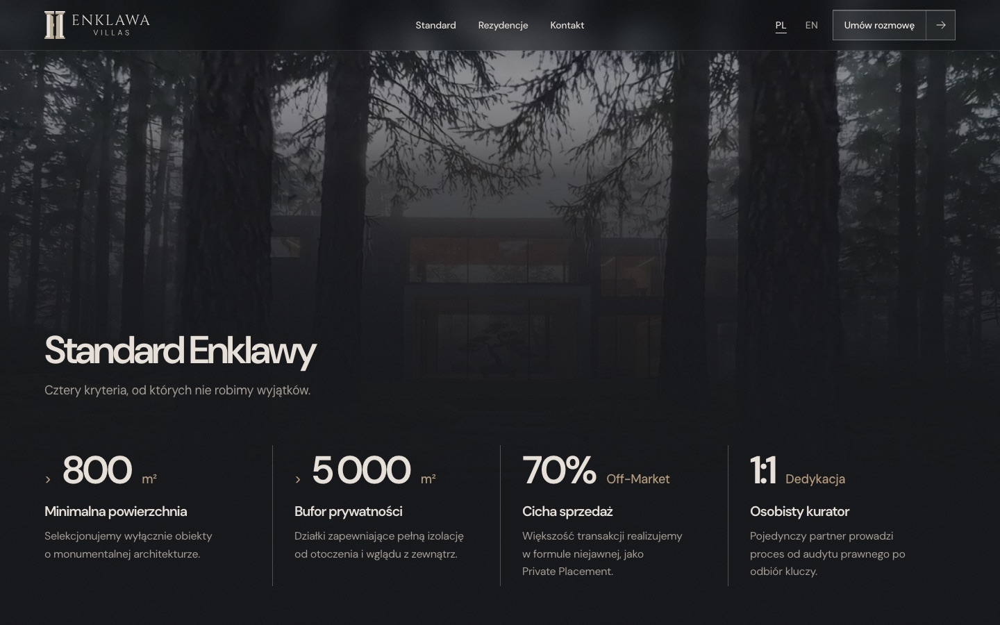 | 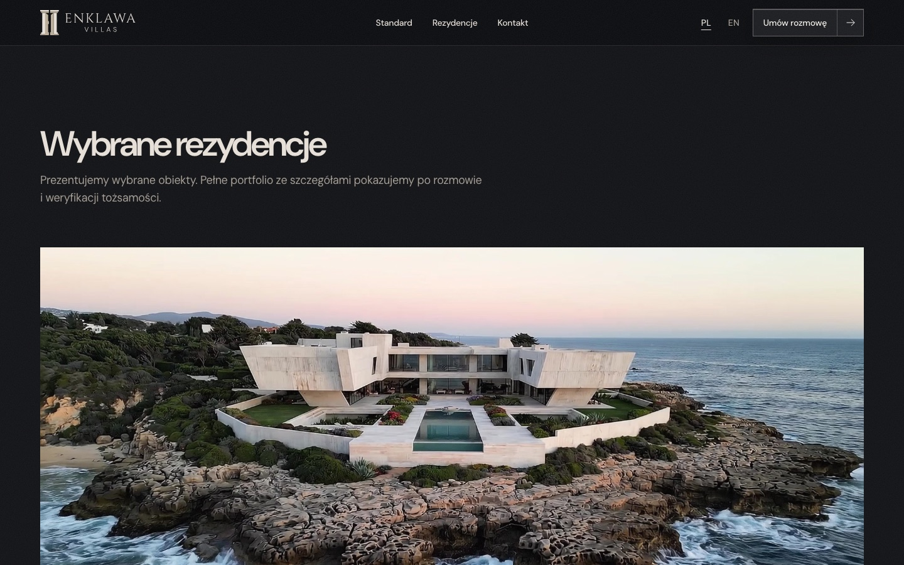 |

| Więcej z portfolio | Strona 404 |
|---|---|
| 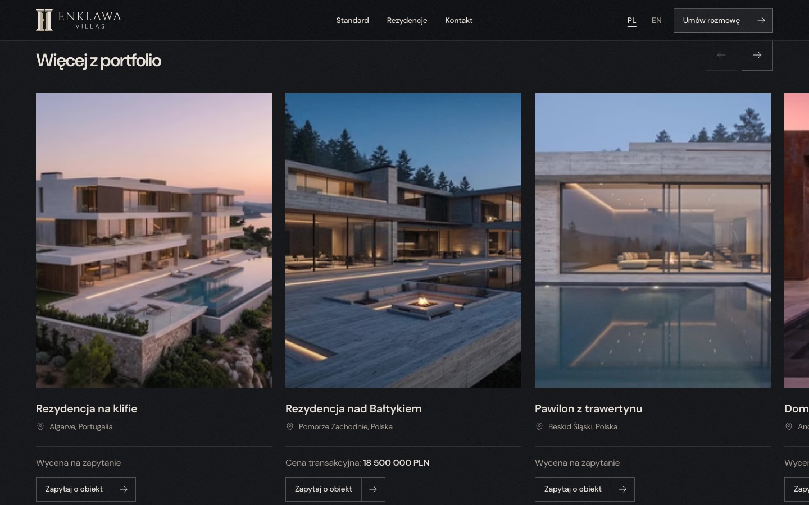 | 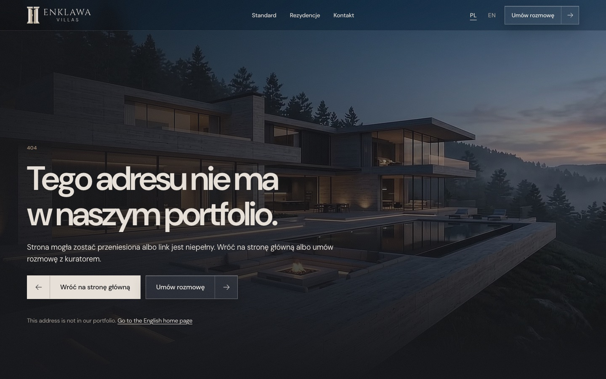 |

### Podstrona rezydencji

| Hero | Opis i najważniejsze informacje |
|---|---|
| 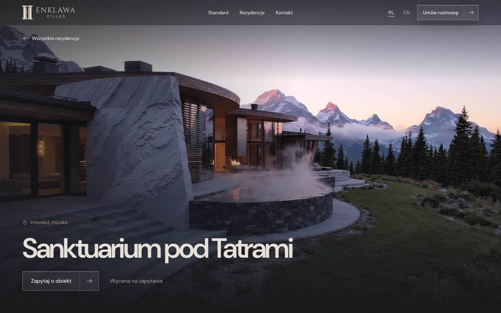 | 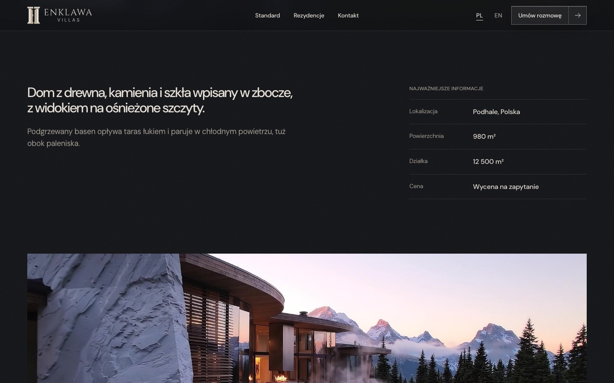 |

| Galeria |
|---|
| 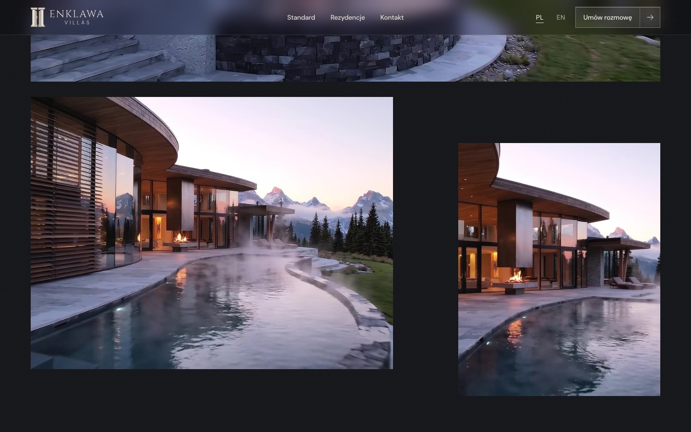 |

### Okno zapytania

| Wybór ścieżki | Formularz z walidacją |
|---|---|
| 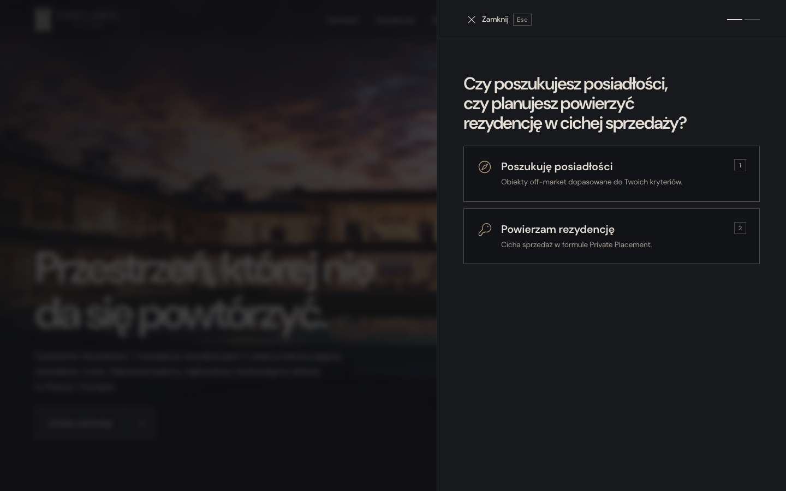 | 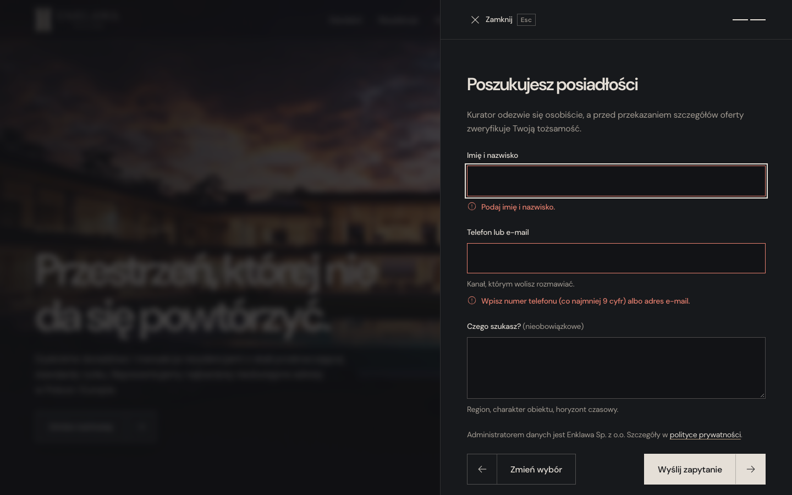 |

### Telefon

| Strona główna | Podstrona rezydencji |
|---|---|
| 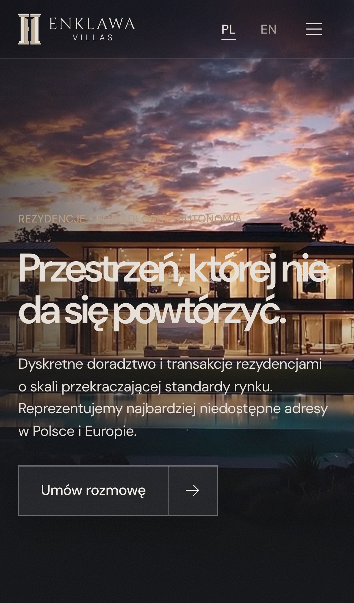 | 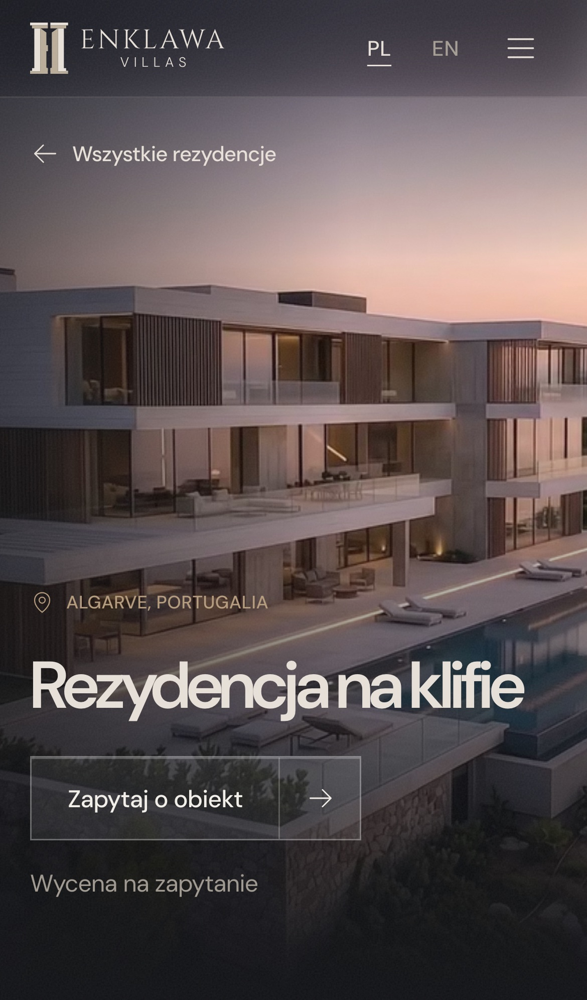 |

Rezydencje, ich nazwy, lokalizacje i nagrania są przykładowe. Zrzuty zrobiono w trybie ograniczonego ruchu, więc w hero widać plakat zamiast filmu.

## Uruchomienie

Wymagany Node.js 22.12 lub nowszy.

```bash
npm install
npm run dev
```

Strona działa pod `http://localhost:4321` (albo pod portem z `--port`).

| Skrypt | Co robi |
|---|---|
| `npm run dev` | Serwer deweloperski |
| `npm run build` | Build do `dist/` |
| `npm run preview` | Podgląd builda |
| `npm run check` | Sprawdzenie typów (`astro check`) |
| `npm run test:e2e` | Build, podgląd na porcie 4332 i 33 testy Playwright |
| `npm run hero` | Film hero i plakaty z `videos/intro1.mp4` |
| `npm run frames` | 192 klatki scrollytellingu z `videos/intro2.mp4` |
| `npm run previews` | 5-sekundowe podglądy i zdjęcia kart |
| `npm run residences` | Filmy podstron i kadry galerii |
| `npm run brand` | Logo SVG, favicon, obrazy Open Graph |

### Własne nagrania

Folder `videos/` z nagraniami źródłowymi nie trafia do repozytorium. Gotowe wyniki (klatki, filmy, zdjęcia)
są w `public/` i `src/assets/`, więc `npm run build` działa od razu. Żeby podmienić materiały, wstaw własne
filmy do `videos/` (1920×1080, ok. 8 s), dopasuj nazwy w `scripts/clips.mjs`, `scripts/hero.mjs`
i `scripts/frames.mjs` i uruchom skrypty mediów. Przepis na nową rezydencję jest w dokumentacji.

## Konfiguracja

Strona nie ma zmiennych środowiskowych. Dane firmy są w jednym pliku:

| Plik | Co zawiera |
|---|---|
| `src/data/site.ts` | E-mail, telefon, dane rejestrowe, polisa OC, hosting. Pola `[[...]]` do uzupełnienia |
| `src/data/properties.ts` | Rezydencje: nazwa, lokalizacja, alt, miejsce w siatce, cena |
| `src/data/residences.ts` | Treść podstron: opis, galeria, powierzchnia i działka |
| `src/i18n/pl.ts`, `en.ts` | Wszystkie teksty interfejsu |

## Struktura

```
scripts/            skrypty mediów (ffmpeg, sharp, opentype.js)
src/
  components/       Intro, Hero, Scrolly, Standard, Portfolio, PropertyCard, Residence, Button, DossierDialog…
  data/             site, properties, residences, frames.json
  i18n/             teksty PL i EN, trasy, formatowanie cen
  layouts/          Base (meta, hreflang, Open Graph), Legal
  pages/            strony PL, en/, rezydencje/[id], sitemap, robots, 404
  scripts/          intro, scrolly, slider, previews, dossier, reveals, residence…
  styles/global.css tokeny, typografia, przyciski
public/             frames/, video/, og/, favicon
tests/e2e/          testy Playwright
docs/
  dokumentacja-techniczna.pdf / .html   trasy, model danych, komponenty, skrypty, testy, wdrożenie
  screenshots/                          zrzuty używane w README
```

## Bezpieczeństwo i prywatność

- Brak backendu, formularza po stronie serwera i danych osobowych w repozytorium.
- Strona nie zapisuje cookies ani danych w `localStorage` i `sessionStorage` (pilnuje tego test) i nie ładuje
  zasobów z zewnętrznych domen, także fontów. Dlatego nie potrzebuje banera zgody.
- Przed publikacją hosting powinien ustawić nagłówki CSP, HSTS, `X-Content-Type-Options`, `Referrer-Policy`,
  `frame-ancestors` i `Permissions-Policy`.

## Wydajność

- Jeden pakiet JS, ok. 57 KB gzip.
- Klatki scrollytellingu: 9,9 MB na desktopie, 6,7 MB na telefonie, w wersji lekkiej ok. 3,3 MB. Pobierają się dopiero po intro.
- Filmy w kartach i na podstronach mają `preload="none"` i ładują się dopiero, gdy mają grać.
- Obrazy jako AVIF i WebP w kilku szerokościach (`srcset`).

## Przed publikacją

- Uzupełnij pola `[[...]]` i zera (telefon, KRS, NIP, REGON) w `src/data/site.ts`, a potem ustaw `phoneConfirmed: true`.
- Powierzchnie i działki w `src/data/residences.ts` są szacunkowe, dobrane do nagrań. Podmień je na prawdziwe.
- Zdecyduj o wysyłce formularza: endpoint serwerowy z limitem zgłoszeń i Turnstile zamiast `mailto:`.
- Nagrania rezydencji są wygenerowane i poglądowe. Regulamin tak je opisuje.

## Dokumentacja

- [`docs/dokumentacja-techniczna.pdf`](docs/dokumentacja-techniczna.pdf): trasy, model danych, okno zapytania,
  komponent Button, intro i scrollytelling, skrypty mediów, testy, wdrożenie.

## Licencja

MIT, Copyright (c) 2026 Szymon Kaczmarczyk. Pełna treść w pliku [`LICENSE`](LICENSE).
